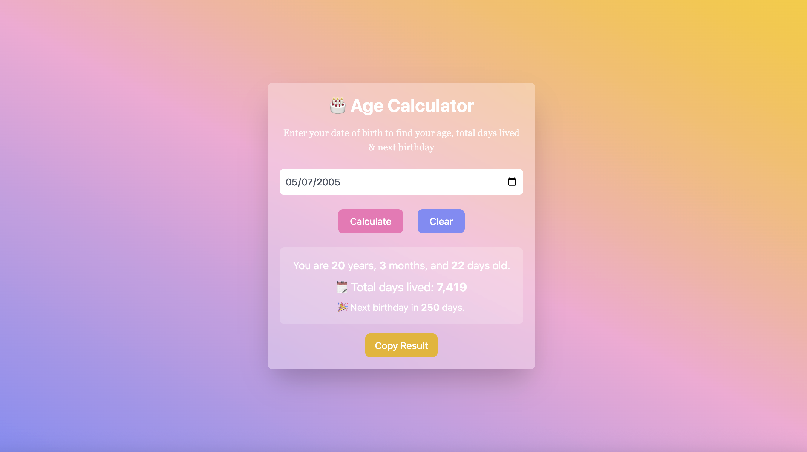

#  Age Calculator App

A simple and responsive **Age Calculator App** built with **HTML**, **Tailwind CSS**, and **JavaScript**.  
It calculates your exact **age in years, months, and days**, and also shows your **total days lived** and **days left until your next birthday** 🎂.

---

## 🚀 Live Demo  
🔗 [View Live App](https://codewithyasu.github.io/AgeCalculatorApp/)

---

## 🖼️ Screenshot  


---

## 🧠 Features

- Calculates **accurate age** (years, months, days)
- Displays **total days lived**
- Shows **days left for next birthday**
- Simple and clean **Tailwind CSS** design
- Fully **responsive layout** for all devices

---

## 🛠️ Technologies Used

- **HTML5**  
- **Tailwind CSS (CDN)**  
- **JavaScript**

---

## ⚙️ How to Use

1. Enter your **date of birth** in the input field.  
2. Click the **“Calculate Age”** button.  
3. Instantly view your age details, total days lived, and next birthday countdown.

---

## 💻 Setup for Local Use

```bash
# Clone the repository
git clone https://github.com/codewithyasu/AgeCalculatorApp.git


📸 Author
👩‍💻 Yasmeen Shaikh
